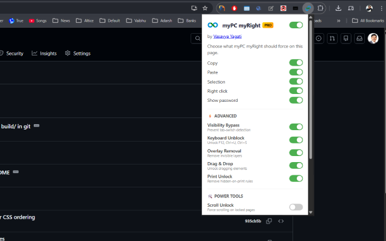

# myPC myRight

`myPC myRight` is a Chrome extension focused on restoring normal browser controls on restrictive websites: selection, copy/paste, right-click, and optional password visibility helpers.

This repository contains both editions:
- **Public** (`myPC myRight`)
- **Pro** (`myPC myRight Pro`)

## Core Features (Public + Pro)

- **Selection + Copy/Paste (combined toggle)**  
  One switch controls text selection, copy, and paste enforcement together.
- **Right click unlock**  
  Re-enables context menu where websites try to block it.
- **Show password**  
  Temporarily reveals password-like fields during hover/focus for easier verification.
- **Global ON/OFF master toggle**  
  Quickly enable or disable the extension behavior for the current tab context.
- **Website exclusions settings**  
  Users can exclude host patterns where extension logic should not run.

### Default Excluded Hosts

These are preconfigured to avoid conflicts with rich editors:
- `docs.google.com`
- `drive.google.com`
- `docs.microsoft.com`
- `*.officeapps.live.com`

Users can edit this list from **Manage site exclusions** in popup (or extension options page).

## Pro Features

In addition to all Public features, Pro includes:

### Advanced
- **Visibility Bypass**
- **Keyboard Unblock**
- **Overlay Removal**
- **Drag & Drop Unlock**
- **Print Unlock**

### Power Tools
- **Scroll Unlock**
- **Video Controls**
- **Autocomplete Enforcer**
- **Exit Dialog Bypass**
- **Element Zapper**

> Pro Advanced toggles are currently defaulted to OFF for safer first-time behavior.

## Install (Unpacked)

1. Open `chrome://extensions/`
2. Turn on **Developer mode**
3. Click **Load unpacked**
4. Select one of:
   - `build/public` for Public edition
   - `build/pro` for Pro edition

## Build ZIP Artifacts

Run:

```powershell
.\build.ps1
```

This generates versioned ZIPs in `build/`, e.g.:
- `myPC-myRight-public-2.0.0.zip`
- `myPC-myRight-pro-2.0.0.zip`

## Screenshots

### Popup UI



## Update Experience

The extension includes:
- version shown in popup
- optional Web Store update availability message
- update notice banner
- local changelog page on update events

## Permissions

Main permissions used:
- `storage` (settings/options)
- `activeTab`
- `tabs` (update/changelog UX)
- content scripts on `<all_urls>` (for behavior control where enabled)

No external API calls are required for core functionality.

## Privacy

- No personal data collection or transmission
- No credential export
- Behavior is local to the browser session and controlled by user toggles/options

## Version History

### 2.0.0 (current)
- Version bump to `2.0.0`
- Combined `Selection + Copy/Paste` toggle
- Added website exclusions options page
- Added popup shortcut to manage exclusions
- Added update notice flow and popup update messaging
- Popup layout improvements (version + exclusions on one line)
- Improved compatibility and stability refinements

### 1.0.4
- Intermediate stabilization release (selection/clipboard compatibility and UI updates)

### 1.0.2
- Stable baseline release used by many users before major 2.x updates

For detailed project-level changes, see [`CHANGELOG.md`](./CHANGELOG.md).  
For Public release summary from `1.0.2` to `2.0.0`, see [`RELEASE_NOTES_PUBLIC_2.0.0.md`](./RELEASE_NOTES_PUBLIC_2.0.0.md).

## Contact

- **Vasavya Yagati**
- **Email:** [vasavya@yagati.com](mailto:vasavya@yagati.com)
- **Company:** [info@spoorthy.org](mailto:info@spoorthy.org)
- **Website:** [https://spoorthy.org/](https://spoorthy.org/)
